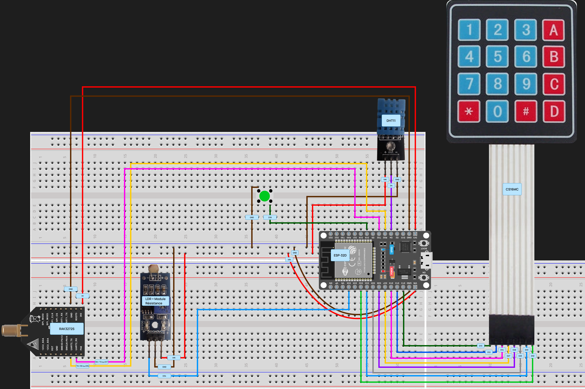
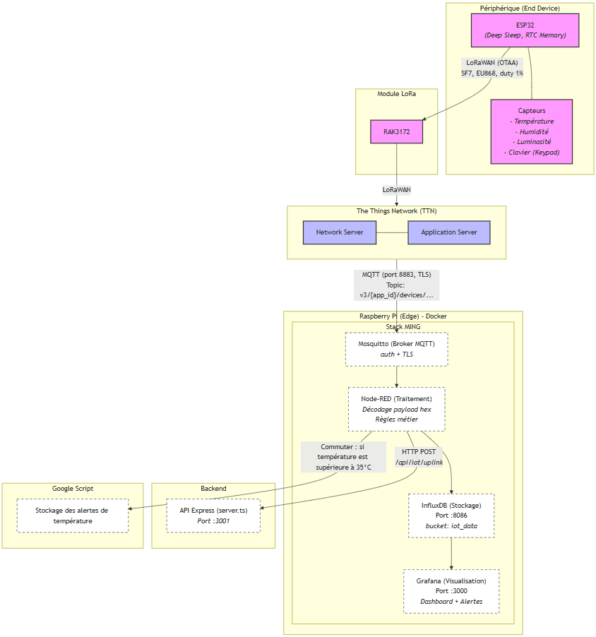

## Description de l'Architecture Physique

Le schéma `architecture_physique.png` présente la topologie matérielle et l'implantation physique du projet IoT Escape Game. 

La liste des composant embarqué :
- carte ESP-32D
- capteur de température & humidité (DHT11)
- capteur de luminosité (LDR + résistance)
- Keypad (CS16MC)
- Rak 3272S + antenne radio
- Bouton poussoir

## Description de l'Architecture

Le schéma `architecture.png` illustre l'architecture complète du projet IoT Escape Game, un système distribué composé de plusieurs couches : périphérique embarqué, réseau LoRaWAN, passerelle edge, backend applicatif et services cloud.

### 1. Périphérique (End Device)
- **ESP32** : Microcontrôleur principal fonctionnant en mode Deep Sleep avec mémoire RTC pour optimiser la consommation énergétique.
- **Capteurs** : Ensemble de capteurs connectés à l'ESP32 :
  - Capteur de température
  - Capteur d'humidité
  - Capteur de luminosité (LDR)
  - Clavier matriciel (Keypad) pour l'interaction utilisateur

### 2. Module LoRa
- **RAK3272S** : Module LoRaWAN utilisé pour la transmission sans fil des données. Configuration :
  - Mode OTAA (Over-The-Air Activation)
  - Spreading Factor 7 (SF7)
  - Bande EU868
  - Cycle de service (duty cycle) de 1%

### 3. The Things Network (TTN)
- **Network Server (TTN_NS)** : Gère le réseau LoRaWAN, traite les paquets uplink/downlink
- **Application Server (TTN_AS)** : Interface applicative pour la gestion des données et des dispositifs
- **Application ID** : tpmatmax

### 4. Raspberry Pi (Edge Gateway) - Docker
Passerelle edge déployée sur Raspberry Pi avec une stack Docker complète appelée "MING Stack" :

- **Mosquitto** : Broker MQTT (accès anonyme)
- **Node-RED** : ( port 1880 ) Plateforme de traitement des données avec :
  - Décodage des payloads hexadécimaux LoRaWAN
  - Application des règles métier du jeu d'évasion
- **InfluxDB** : Base de données temporelle (port 8086, bucket "iot_data")
- **Grafana** : Interface de visualisation et d'alertes (port 3000)

### 5. Backend
- **API Express (server.ts)** : Serveur applicatif TypeScript (port 3001) recevant les données via HTTP POST sur l'endpoint `/api/iot/uplink`

### 6. Google Script
Service de stockage des alertes de température, déclenché lorsque la température dépasse 35 C.

## Flux de Données

1. **Collecte** : Les capteurs envoient leurs données à l'ESP32
2. **Transmission** : L'ESP32 encode et transmet via LoRaWAN au module RAK3272S
3. **Réseau** : Le RAK3272S relaie vers The Things Network (TTN)
4. **Edge Processing** : TTN publie les données via MQTT (port 1883) vers Mosquitto
5. **Traitement** : Node-RED traite les données et les stocke dans InfluxDB
6. **Visualisation** : Grafana affiche les données et génère des alertes
7. **Application** : Node-RED envoie les données pertinentes à l'API backend via HTTP POST
8. **Alertes** : En cas de température > 35°C, Node-RED déclenche l'envoi vers Google Script

Cette architecture permet une collecte de données avec traitement en temps réel, stockage temporel et visualisation interactive, ainsi que l'utilisation des données pour une futur application web d'escape game nécessitant des capteurs lumineux, thermique, d'humidité ainsi que d'un Keypad.